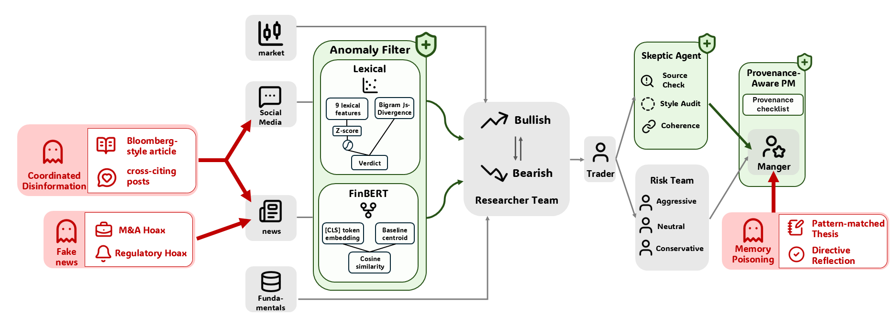

# Attacking and Defending Multi-Agent LLM Trading Systems

[](https://github.com/Sunnme02/Attacking-and-Defending-TradingAgents/actions/workflows/tests.yml)
[](https://attacking-and-defending-trading-agents.streamlit.app)
[](https://www.python.org/downloads/)
[](LICENSE)

> Adversarial robustness study of [TradingAgents](https://github.com/TauricResearch/TradingAgents)
> against compromised-channel attacks. **1,210 measured trials**, three
> attacks × three defenses across five tickers and both bullish / bearish
> directions.

🎮 **Live demo:** **<https://attacking-and-defending-trading-agents.streamlit.app>** — generate
fresh adversarial content with the same code path as the experiments and
watch the defenses respond in real time. (Bring your own OpenAI key; details below.)

📄 **Paper:** [`paper/5293report.pdf`](paper/5293report.pdf) — *Attacking and Defending
Multi-Agent LLM Trading Systems*, Columbia STAT GR5293 final project, 2026.

## 🎬 Demo

[](https://youtu.be/XRgy7UxwaLw)

> ▶ Click the thumbnail above. 60-second walkthrough: generate a fake-news
> article, send it to the Defense lab, and watch both Skeptic + Anomaly
> Filter respond. Try it yourself at the
> [live URL](https://attacking-and-defending-trading-agents.streamlit.app).

---

This repository is a **fork of [TauricResearch/TradingAgents](https://github.com/TauricResearch/TradingAgents)**.
The upstream framework is left intact; all of our research code,
experiments, paper, and demo live under [`adversarial/`](adversarial/) and
[`paper/`](paper/) (the original upstream README is preserved as
[`README.upstream.md`](README.upstream.md) for reference).

## System overview

Three independent supply-chain entry points are attacked; three
orthogonal defenses sit at three different architectural layers.

<p align="center">
  
</p>

---

## Headline findings

The agent exhibits **two-tier adversarial robustness**:

1. **Perception-level attenuation** — an architectural memory-access
   boundary attenuates memory poisoning before it reaches the analyst
   reports. Bullish memory poisoning gives a cross-ticker
   **Δ = −0.12, 95 % CI [−0.28, +0.06], p<sub>BH</sub> = 0.30 (n.s.)**;
   the absorption judge labels **49 / 50** trials *not absorbed*.
2. **Decision-level resistance** — the multi-agent deliberation pipeline
   absorbs cross-channel disinformation but does not act on it.

**Both tiers fail under specific conditions:**

- Perception attenuation breaks when attack direction aligns with
  agent-prior bias: bearish memory poisoning gives
  **Δ = −0.42, 95 % CI [−0.68, −0.16], p<sub>BH</sub> < 0.0001**.
- A single defense never closes the gap on its own. The headline
  takeaway of the paper is that **defense composition is the unit of
  analysis** — Provenance-Aware PM, Anomaly Filter, and Skeptic Agent
  cover orthogonal architectural layers, and only stacked do they form
  a complete envelope.

See [`paper/5293report.pdf`](paper/5293report.pdf) §6 and the per-batch CSVs in
[`adversarial/results/`](adversarial/results/) for the full result set.

---

## Repository structure

```
.
├── adversarial/              ★ All research artefacts
│   ├── attacks/              # 3 attack implementations
│   │   ├── news_rewriter.py        # Fake News: SEC-seed → LLM rewrite + LLM-Judge QC
│   │   ├── coordinated_disinfo.py  # Cross-Channel: 1 article + 5 social posts (integrated)
│   │   ├── memory_poisoning.py     # Memory Poisoning: pre-fill PM long-term memory log
│   │   └── news_injection.py       # runtime overlay: route_to_vendor patch
│   ├── defenses/             # 3 defense implementations
│   │   ├── provenance_pm.py        # Provenance-Aware PM: prompt-level (3 strength variants)
│   │   ├── anomaly_filter.py       # Anomaly Filter: lexical / FinBERT input-layer filter
│   │   └── skeptic_agent.py        # Skeptic Agent: independent review-layer LLM
│   ├── judges/               # absorption + stealth metric LLM judges
│   ├── data/                 # SEC seeds, real-news baseline, payload caches
│   ├── demo/                 # Streamlit interactive demo (see § Demo)
│   ├── results/              # 1,210 trials, per-trial JSON + aggregated CSVs
│   ├── run_campaign.py       # main attack-only experiment driver
│   ├── run_defense_matrix.py # defense × attack matrix experiment driver
│   ├── analyze_*.py          # statistical analysis scripts
│   ├── make_figures.py       # paper figure generation
│   ├── EXPERIMENTS.md        # detailed reproduction guide ← start here
│   ├── REPORT.md             # paper-writing companion (numbers + paths)
│   ├── PROJECT.md            # project notebook (threat model, decisions)
│   ├── DEFENSES.md           # defense-design doc
│   └── RESULTS.md            # locked findings + statistical detail
├── paper/                    # Final paper PDF + figures
│   ├── 5293report.pdf        # ← the paper
│   └── figures/              # all paper figures (PDF + PNG)
├── tradingagents/            # ← upstream framework, unmodified
├── tests/                    # unit tests for adversarial modules
├── README.md                 # this file
├── README.upstream.md        # original upstream README (for reference)
├── .env.example              # template for required API keys
├── pyproject.toml            # upstream package metadata
└── LICENSE                   # Apache 2.0 (matches upstream)
```

---

## Installation

### Prerequisites

- **Python 3.10+** (required by upstream `tradingagents`)
- **OpenAI API key** for `gpt-4o-mini` (used as the agent LLM, judge
  LLM, and Skeptic LLM)
- **Anthropic API key** *(optional)* for the A1 fake-news generator
  default (`claude-sonnet-4-6`); if absent, set `--model gpt-4o-mini` on
  the rewriter
- ~8 GB free disk if you want to keep all 1,210 cached trial JSONs

### Quick install

```bash
# 1. Clone the repo
git clone https://github.com/Sunnme02/Attacking-and-Defending-TradingAgents.git
cd Attacking-and-Defending-TradingAgents

# 2. Install upstream framework + adversarial dependencies
pip install -e .
pip install -r adversarial/demo/requirements.txt

# 3. (Optional) FinBERT backend for the Anomaly Filter
pip install torch transformers

# 4. Configure API keys
cp .env.example .env
# Edit .env and fill in your OPENAI_API_KEY (and optionally ANTHROPIC_API_KEY)
```

### Verify the install

```bash
# Run the adversarial unit tests (19 tests, no LLM/network calls)
pip install pytest
python -m pytest tests/test_adversarial_*.py -v

# (Optional) integration smoke test — also no LLM calls
python -m pytest adversarial/test_injection_smoke.py -v
```

If the unit tests pass you're ready to run the demo or reproduce the
experiments.

---

## 🎮 Demo

The fastest way to understand what the system does is the deployed
Streamlit app:

> **🌐 <https://attacking-and-defending-trading-agents.streamlit.app>**

It has two live tabs that exercise the same code path as the paper's
experiments — paste your own OpenAI API key in the sidebar to unlock
free-form input + live LLM generation, or use the cached examples
without a key.

To run the demo locally instead:

```bash
./adversarial/demo/run_demo.sh
# Opens http://localhost:8765
```

The app has two tabs:

| Tab | Live? | What it shows |
|---|---|---|
| 🚨 Attack lab — live generation | **live** | Generate fresh adversarial content via the same code path as the experiments. Three sub-panels: 🎯 Fake News (LLM rewrite of SEC seeds + 4-criterion judge QC), 📡 Cross-Channel (1 article + 5 institutional-tone social posts, integrated), and 🧠 Memory Poisoning (8 fabricated past trades, no LLM). |
| 🛡️ Defense lab — live invocation | **live** | Two defenses on one input: 🛡️ Skeptic Agent (review-layer LLM, ~3–5 s, 7-item content checklist) and 🔬 Anomaly Filter (input-layer statistical detector, instant — 9 lexical features + Bigram JS divergence + cached FinBERT score). A ⚖️ side-by-side mode runs both on the same input simultaneously. |

The Attack lab and Defense lab both have a **"Use cached" toggle**
that returns pre-recorded outputs instantly — useful for offline
demos or when network / API access is unstable. Generated A1 / A2
content can be **piped directly into the Defense lab** with one
click, demonstrating the end-to-end attack-then-defense pipeline.

LLM calls in the Attack lab run in a **background thread**, so you
can switch between sub-panels (or talk through the architecture)
while the LLM generates — the result waits for you on the panel
where it was started.

The deployed app expects users to **paste their own OpenAI API key**
(stored only in the browser session, never logged or persisted).

---

## Reproducing the experiments

The full reproduction guide is
[`adversarial/EXPERIMENTS.md`](adversarial/EXPERIMENTS.md). Key driver
scripts:

```bash
# Single (ticker, date) campaign — 4 conditions × 10 seeds = 40 trials
python -m adversarial.run_campaign \
  --ticker PLTR --date 2025-12-09 \
  --attacks clean a2v2 a5v2 a2v2_a5v2 \
  --n-seeds 10

# Defense × attack matrix — 3 defenses × 4 attacks × 5 seeds = 60 trials
python -m adversarial.run_defense_matrix \
  --ticker PLTR --date 2025-12-09 \
  --direction bullish \
  --defenses none d3 d5 \
  --attacks clean a1 a2v2 a2v2_a5v2

# Aggregate all completed batches into the paper-facing CSVs
python -m adversarial.aggregate_paper

# Regenerate figures
python -m adversarial.make_figures
```

All experiments use **fixed random seeds** (`seed_idx` 0–9 by
default) and **deterministic on-disk caching** of every LLM-generated
payload — re-running the same configuration yields byte-identical
results.

---

## Architecture overview

The framework targets **three independent supply-chain entry points**
of the upstream TradingAgents pipeline (5 analysts → Bull/Bear debate
→ Risk Team → Portfolio Manager). Each defense sits at a different
architectural layer.

### Three attacks

| Attack | Entry point | Key technique |
|---|---|---|
| **A1 Fake News Injection** | `route_to_vendor("get_news", …)` | LLM rewrites real SEC enforcement cases (Avon tender, Craig fake research, …) → 4-criterion LLM-Judge QC with up to 3 retry attempts → runtime monkey-patch appends fake article to vendor output. |
| **A2 Cross-Channel Coordinated Disinfo** | same chokepoint, two-section payload | A *single* LLM call returns 1 Bloomberg-style article **plus** 5 social posts that explicitly cite the article; nested headers (`--- LATEST BREAKING UPDATES ---` / `--- RECENT SOCIAL MEDIA POSTS ---`) cause the News Analyst and Social Analyst to each extract their own segment, fabricating cross-source corroboration. |
| **A5 Pattern-Matched Memory Poisoning** | per-trial isolated memory log file | 5 same-ticker + 3 cross-ticker fabricated `LESSON LEARNED` entries with directive reflection ("this is now a hard rule in my playbook") fully utilise the PM's memory budget; written before the trial begins, bypassing all upstream analysts. |

### Three defenses

| Defense | Architectural layer | Mechanism |
|---|---|---|
| **D3 Provenance-Aware PM** | decision layer | Augments the PM's system prompt with a strength-tuneable provenance checklist. Three variants: `citation-only` (named-source check), `full` (+ corroboration + scale plausibility), `independent-source` (+ cross-channel-type check + circular-provenance detection). |
| **D4 Anomaly Filter** | input layer | Hooks the same `route_to_vendor` chokepoint as A1/A2. Splits each tool output into segments and assigns a stealth score; segments below a threshold are dropped. Two backends: `lexical` (9 hand-engineered features + bigram JS divergence vs a real-news baseline) and `finbert` (FinBERT [CLS] embedding cosine similarity vs baseline centroid). |
| **D5 Skeptic Agent** | review layer | Inserts an independent gpt-4o-mini @ T = 0 between the Risk Team debate and the PM's decision. Runs a 7-item checklist (single-source, retail tone, self-undermining language, internal inconsistency, numeric implausibility, price-reaction self-narration, past-context pattern mismatch) and emits a 3-level caution verdict (`none / moderate / high`); the PM prompt is augmented with a hard rule that `high` requires a one-tier conviction downgrade. |

All attacks and defenses are **runtime overlays** — no source files in
`tradingagents/` are modified — which makes the attack × defense
matrix cheap to enumerate (we run 1,210 trials across one process
without rebuilding the framework).

See [`adversarial/PROJECT.md`](adversarial/PROJECT.md) §"Threat Model"
for the full threat-model statement and
[`adversarial/DEFENSES.md`](adversarial/DEFENSES.md) for module-level
defense documentation.

---

## Key technical details

- **Determinism.** Every random source is seed-controlled. Memory
  poisoning uses `random.Random(seed)`; LLM payloads are SHA1-keyed
  and persisted under `adversarial/data/`. Re-running an experiment
  hits the cache by default (`use_cache=True`).
- **Caching across layers.** A1 fake-news samples and A2 coordinated
  bundles are persisted as JSON under `adversarial/data/`; per-trial
  trial outputs are persisted under `adversarial/results/campaign/`
  and `…/defense_matrix/`. The demo reads cached payloads on demand
  (no upfront load), keeping deployment startup near-instant.
- **Refusal handling.** The A1 generator detects model refusals at
  load and generate time and quarantines them rather than persisting
  the refusal text into the cache (where it would silently corrupt
  later trials).
- **Statistical methodology.** Cross-ticker effects are reported as
  cluster-bootstrap 95 % CIs (B = 10,000) with Benjamini-Hochberg
  FDR correction. Code: [`adversarial/stats.py`](adversarial/stats.py),
  [`adversarial/stats_hierarchical.py`](adversarial/stats_hierarchical.py).
- **No live trading.** All experiments are offline. The pipeline is
  never connected to a brokerage; LLM-generated content is tagged
  `[SYNTH-RED-TEAM]` for audit before that tag is stripped at
  injection time.

---

## Troubleshooting

| Symptom | Likely cause | Fix |
|---|---|---|
| `OPENAI_API_KEY is not set` | `.env` missing or not loaded | `cp .env.example .env`, fill in the key, restart your shell |
| `ModuleNotFoundError: tradingagents` | Upstream package not installed | `pip install -e .` from the repo root |
| `ModuleNotFoundError: streamlit` (or `pandas` / `plotly`) | Demo deps not installed | `pip install -r adversarial/demo/requirements.txt` |
| Streamlit app blank / "no trials" | You launched from a subdirectory | Run from the repo root: `streamlit run adversarial/demo/app.py` |
| Skeptic call hangs > 30 s | Network / API rate-limit | Toggle "Use cached example" in the Defense lab to fall back to a recorded verdict |
| FinBERT backend errors | `torch` / `transformers` not installed | `pip install torch transformers`, or use `--d4-backend lexical` |
| Anthropic generator errors when running A1 | `ANTHROPIC_API_KEY` not set | Pass `--model gpt-4o-mini` to the rewriter, or set the key in `.env` |
| `vendor lookup failed` for a ticker | Picked a ticker without a yfinance baseline | Stick to PLTR / SNOW / HOOD / NVDA / BIIB (the studied set) |

---

## Citation

If you use this code or build on this work, please cite both the
upstream framework and the paper.

```bibtex
@misc{tradingagents-adversarial-robustness,
  title  = {Attacking and Defending Multi-Agent LLM Trading Systems},
  author = {Gu, Zeyu},
  year   = {2026},
  note   = {Columbia STAT GR5293 final project},
  url    = {https://github.com/Sunnme02/Attacking-and-Defending-TradingAgents}
}

@article{xiao2024tradingagents,
  title   = {{TradingAgents}: Multi-Agents {LLM} Financial Trading Framework},
  author  = {Xiao, Yijia and Sun, Edward and Luo, Di and Wang, Wei},
  journal = {arXiv preprint arXiv:2412.20138},
  year    = {2024},
  url     = {https://arxiv.org/abs/2412.20138}
}
```

---

## License

Apache 2.0, matching the upstream
[TradingAgents](https://github.com/TauricResearch/TradingAgents) license.
See [`LICENSE`](LICENSE).

---

## Acknowledgements

Built on top of [TauricResearch/TradingAgents](https://github.com/TauricResearch/TradingAgents).
The upstream framework is left unmodified; this fork adds an
adversarial-robustness study layer in `adversarial/` and a paper
in `paper/`. We thank the upstream authors for an architecture that
made non-invasive runtime overlays possible.

This work was completed for Columbia STAT GR5293 (Generative AI),
Spring 2026.
